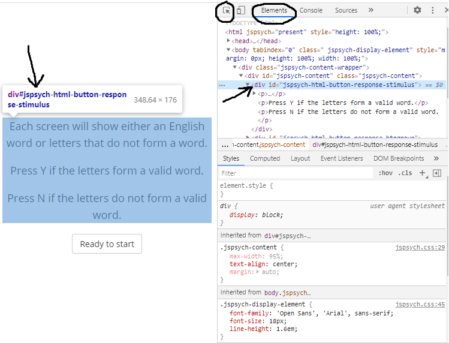

# Controlling Visual Appearance

Your experiment's style and formatting comes from the CSS (cascading style sheet) rules that are stored in the jspsych.css file, and the browser's defaults. There are a few ways to change the style and formatting in your experiment. The method that you choose is partly a matter of personal preference. It might also depend on whether you want the style/formatting change(s) to apply to _specific trials_, to _the whole experiment_ (HTML page), or across _different experiments_. This section discusses the different ways of incorporating CSS into your jsPsych experiment. You can also see [this page about adding CSS to web pages](https://www.w3schools.com/html/html_css.asp) to learn more.

## Inline CSS

Whenever you're using a parameter that accepts an HTML-formatted string, you have the option to include inline CSS. Inline CSS is a way of adding style and formatting directly into a specific HTML element using its ["style" attribute](https://www.w3schools.com/tags/att_style.asp). This is a good option for when you want to make few and/or simple style changes to an HTML trial parameter.

To change an element's style using inline CSS, you can set the element's "style" attribute to a string that contains the CSS parameters that you want to change, along with the values that you want to use. The syntax is " &lt;parameter-name> : &lt;parameter-value> ;". 

In the example below, the stimulus font size is set to 30px and the text color is set to red. These changes will _only_ be applied to this stimulus text in this specific trial.

```javascript
var trial = {
	type: 'html-keyboard-response',
	stimulus: '<p style="font-size:30px;color:red;">hello world!</p>'
}
```

You can also use a [dynamic parameter](/overview/dynamic-parameters) to combine inline CSS and trial-specific variables. This allows you to easily apply the same inline CSS to multiple trials. Here's an example using a dynamic stimulus parameter and [timeline variables](/overview/timeline/#timeline-variables):

```javascript
var trial = {
	type: 'html-keyboard-response',
	stimulus: function() {
        var stim = '<p style="font-size:30px;font-weight:bold;">'+jsPsych.timelineVariable('text')+'</p>';
        return stim;
    }
}
var trial_procedure = {
    timeline: [trial],
    timeline_variables: [
        {text: 'Welcome'},
        {text: 'to'},
        {text: 'the'},
        {text: 'experiment!'}
    ]
}
```

## Adding CSS rules

You may want to add a lot of different CSS changes to your experiment, re-use the same change(s) across lots of different trials, and/or separate the style/formatting from the HTML string. In these cases, you might find it useful to create CSS rules rather than using inline CSS. 

Creating CSS rules is a lot like using inline CSS, except that you also need to use a [CSS selector](https://www.w3schools.com/css/css_selectors.asp). This is because your CSS rules aren't attached to any specific HTML element (unlike inline CSS), so you need to tell the browser which element(s) the style rules should apply to. The syntax is "css-selector { &lt;parameter-name> : &lt;parameter-value> ; }". 

In the example below, the CSS selector "p" tells the browser to apply the font size change to any text that is inside of a &lt;p> element.

```css
p {
  font-size: 30px;
}
```

You can make more specific changes using CSS rules. The specificity will depend on the CSS selectors that are used. In addition to using the [tag name](https://www.w3schools.com/cssref/sel_element.asp) (e.g. "p"), other common CSS selectors include the element's [ID](https://www.w3schools.com/html/html_id.asp) or [class](https://www.w3schools.com/html/html_classes.asp). If you are selecting an element using it's ID, then the CSS selector needs to have a \# in front of the ID, e.g. "\#stimulus". If you are selecting elements based on their class, then you need to include a . in front of the class, e.g. ".large-text".

In the example below, the "#stimulus" CSS selector means that the width change will only affect elements with the "stimulus" ID, and the ".large-text" CSS selector means that the font size change will only affect elements that have the "large-text" class.

```css
#stimulus 
    width: 300px;
}
.large-text {
    font-size: 200%;
}
```

It is possible to create even more specific CSS selectors, for instance by combining tags, IDs, and/or classes. For example, let's say that you are showing feedback text to participants, and that this text is inside of a &lt;p> tag. You could add the ID "correct" to the &lt;p> element for correct response feedback, and the ID "incorrect" to the &lt;p> element for incorrect response feedback. Then you can define separate styles for correct and incorrect feedback text like this:

```css
p#incorrect {
  color: red;
}
p#correct {
  color: green;
}
```

See [this page about CSS selectors](https://www.w3schools.com/cssref/css_selectors.asp) for a complete reference of CSS selector patterns and their meanings.

### With style tags

You can add CSS rules to your HTML page by putting them inside of &lt;style> tags. These rules will be applied to your _whole experiment_. This method can be useful for making general changes to the way that your experiment looks. 

In the example below, the default font size is set to 25px throughout the experiment. This will overrule the default font size of 18px that is set in the jspsych.css file.

```html
<head>
  <script src="jsPsych/jspsych.js"></script>
  <script src="jsPsych/plugins/jspsych-html-keyboard-response.js"></script>
  <link rel="stylesheet" href="jsPsych/css/jspsych.css">
  <style> 
    .jspsych-display-element {
      font-size: 25px;
    }
  </style>
</head>
```

### With a stylesheet

CSS rules can also be applied to your experiment with a link to an external CSS file. This is the same method that is usually used to apply the style from jspsych.css to an experiment. These rules will be applied to your _whole experiment_. You may find it useful to use a custom stylesheet when you want to re-use the same CSS rules across _multiple experiments_ (HTML files).

This example shows how to add a custom CSS file in addition to the styles provided in jspsych.css:

```html
<head>
  <script src="jsPsych/jspsych.js"></script>
  <script src="jsPsych/plugins/jspsych-image-keyboard-response.js"></script>
  <link rel="stylesheet" href="jsPsych/css/jspsych.css">
  <link rel="stylesheet" href="my_experiment_style.css">
</head>
```

Below are the some example contents of an external CSS file, like the "my_experiment_style.css" from the example above. This CSS will (1) change the page background color to black, (2) change the default font to 25px and white, and (3) limit the width of the page content so that it can only take up to 80% of its normal width. 

```css
body {
  background-color: black;
}
.jspsych-display-element {
  font-size: 25px;
  color: white;
}
.jspsych-content {
  max-width: 80%; 
}
```

!!! note  
    &lt;style> tags are not used inside of an external CSS file.

### Using the css_classes trial parameter

CSS rules can also be applied in a trial-specific way using the `css_classes` parameter. This parameter will apply one or more class to the &lt;div> element that holds all of the jsPsych page content during that specific trial. This way you can treat CSS styles just like any other trial parameter. 

You can use a static `css_classes` parameter value if you always want to apply the same CSS rules to the trial. In the 'fixation' example below, separating the style rules from the `stimulus` string makes the code a little bit 'cleaner', and this makes it easier to re-use the same style rules in other parts of the experiment.

```html
 <head>
  <script src="jsPsych/jspsych.js"></script>
  <script src="jsPsych/plugins/jspsych-html-keyboard-response.js"></script>
  <link rel="stylesheet" href="jsPsych/css/jspsych.css">
  <style> 
    .fixation {font-size: 90px; font-weight: bold; color: gray;}
  </style>
</head>
<script>
var fixation = {
    type: 'html-keyboard-response',
    stimulus: '+',
    choices: jsPsych.NO_KEYS,
    trial_duration: 500,
    css_classes: ['fixation']
}
// ...
</script>
```

You may want the  `css_classes` parameter to vary across trials. If so, you can turn it into a [dynamic parameter](/overview/dynamic-parameters) or use [timeline variables](/overview/timeline/#timeline-variables) (see examples below). 

One thing to note about the `css_classes` parameter is that it only adds the class(es) to the jspsych-content &lt;div> element, which is the "parent" element that contains all of the experiment content. Often you'll want your CSS rules to be applied to other elements _inside_ of this jspsych-content div. Sometimes your CSS rules will be "inherited" by all of the other jsPsych content inside of this parent &lt;div>. For instance, in the `fixation` example above, the CSS rules that change the font size, weight and color are applied to the parent &lt;div> and automatically passed on to the stimulus text through inheritance.

There are two reasons why a CSS rule like the one above for `fixation` may not work the way you expect:

1. Not all CSS properties are inherited from the parent element.

2. When a CSS property is inherited from the parent element, it will affect _all_ elements in a given trial. 

In these cases, you can change your CSS selector to make it more specific: add a space after class name, then add _more CSS selectors_ to select the specific element(s) that you want to change. 

!!! tip
    To find out this more specific CSS selector, you can right-click on the element and select *Inspect*. In the inspector window, right-click on the property corresponding to the element and copy the selector. You might need to increase the trial's `trial_duration` to give yourself enough time to inspect the elements on the page. See more [tips for working with CSS](#tips-for-working-with-css) below.

In the example below, the CSS selector `.left-align #stimulus` selects the element with the ID "stimulus" that is _inside_ of an element with the class "left-align".

```html
<head>
  <script src="jsPsych/jspsych.js"></script>
  <script src="jsPsych/plugins/jspsych-html-keyboard-response.js"></script>
  <link rel="stylesheet" href="jsPsych/css/jspsych.css">
  <style> 
    .left-align #stimulus {text-align: left; width: 600px;}
    .right-align #stimulus {text-align: right; width: 600px;}
  </style>
</head>
<script>
var trial_procedure = {
    timeline: [{
        type: 'html-keyboard-response',
        stimulus: '<p id="stimulus">This is the stimulus.</p>',
        prompt: '<p>This text will not be affected by the CSS classes '+
            'because it does not have the "stimulus" ID.</p>',
        css_classes: jsPsych.timelineVariable('css_classes')
    }],
    timeline_variables: [
        {css_classes: ['left-align']},
        {css_classes: ['right-align']}
    ]
}
// ...
</script>
```

It's also possible to pass multiple class names to the `css_classes` parameter. This can be useful for creating conditions that involve crossing different style-related factors. This example shows you to combine two text alignment and two text color factors to produce four different stimulus conditions:

```html
<head>
  <script src="jsPsych/jspsych.js"></script>
  <script src="jsPsych/plugins/jspsych-html-keyboard-response.js"></script>
  <link rel="stylesheet" href="jsPsych/css/jspsych.css">
  <style> 
    .left-align #stimulus {text-align: left; width: 600px;}
    .right-align #stimulus {text-align: right; width: 600px;}
    .teal #stimulus {color: teal;}
    .purple #stimulus {color: purple;}
  </style>
</head>
<script>
var trial_procedure = {
    timeline: [{
        type: 'html-keyboard-response',
        stimulus: '<p id="stimulus">This is the stimulus.</p>',
        prompt: '<p>This text will not be affected by the CSS classes '+
            'because it does not have the "stimulus" ID.</p>',
        css_classes: jsPsych.timelineVariable('css_classes'),
        data: {condition: jsPsych.timelineVariable('condition')}
    }],
    timeline_variables: [
        {css_classes: ['left-align','teal'], condition: 'left-teal'},
        {css_classes: ['right-align','teal'], condition: 'right-teal'},
        {css_classes: ['left-align','purple'], condition: 'left-purple'},
        {css_classes: ['right-align','purple'], condition: 'right-purple'}
    ]
}
// ...
</script>
```

See the "css-classes-parameter.html" file in jsPsych's examples subfolder for more explanation and examples.

## Tips for working with CSS

Your browser's developer tools contain very useful features for exploring and debugging your experiment's style and formatting. Open your browser's developer tools and click on the Element Inspector button or go to the Elements tab. Once you have selected an element on the page, you can see all of the information that can be used to select it, including:

1. tag name, e.g., "div", "p", "img", "button"
2. ID, if it has one
3. class(es), if it has any

You can then use this information to create a CSS selector to modify that element's style.



As you can see, jsPsych adds its own IDs and classes to many elements. You can use the developer tools to determine what IDs and classes already exist for the elements that you want to modify, as you may can often just use these instead of adding your own. For instance, in the "html-keyboard-response" plugin, the stimulus will always be shown in a &lt;div> with the ID "jspsych-html-keyboard-response-stimulus". So you can create a CSS rule that is applied to all "html-keyboard-response" stimuli like this:

```css
#jspsych-html-keyboard-response-stimulus {
  color: white;
  background-color: blue;
  width: 100px;
  border: 4px solid black;
}
```

As another example, most jsPsych buttons have the class "jspsych-btn", so you can use this class to change the default button styling:

```css
.jspsych-btn {
  padding: 20px 20px;
  font-size: 25px;
  border-color: black;
}
```

You can also use the developer tools to change an element's CSS and immediately see the effect that the changes will have on the page. These changes are just temporary, so you will still need to use one of methods described above to add the CSS changes to your experiment. However, making changes in the developer tools is very useful for figuring out which CSS properties to change and which values to use. This area of the developer tools also shows what styles are currently applied to the element and where those style rules are coming from. 


There are a few things to be aware of while debugging problems with CSS. 

1. When there are conflicting CSS rules, *some CSS rules will take precedence over others*. For instance, inline CSS usually takes precedence over other CSS rules, and more specific CSS selectors usually take precedence over less specific ones. 
2. When there are conflicting CSS rules that have the same level of precedence, *the last rule will override any earlier rules*. For that reason it's important to add your own custom stylesheet _after_ the default jspsych.css stylesheet. See [this page about CSS precedence](https://www.w3schools.com/css/css_specificity.asp) for more information.

If one CSS style rule is overridden by another one, the rule that is overridden will appear in <s>strikethrough text</s> in the element's "Styles" section. Also, if you are using an incorrect CSS property name or an invalid value, then that will show up here as an error, indicated by both <s>strikethrough text</s> and a little yellow warning symbol.


