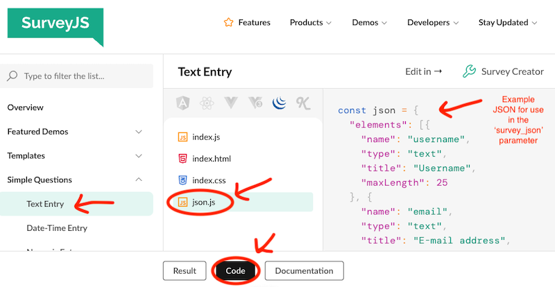

# survey

Current version: 0.2.2. [See version history](https://github.com/jspsych/jsPsych/blob/main/packages/plugin-survey/CHANGELOG.md).

The survey plugin displays one or more questions of different types, on one or more pages that the participant can navigate. This plugin is built on top of the [SurveyJS](https://surveyjs.io/) form library. 

## SurveyJS Documentation

SurveyJS is a large and powerful library, with lots of helpful documentation. Here we have tried to orient jsPsych users to the basic steps for constructing surveys and highlight the features that jsPsych users may find most useful. However, it is not possible for us to reproduce the SurveyJS documentation here, so we encourage you to use their documentation and examples. 

!!! note
    SurveyJS offers a number of different products - when looking at their documentation website, make sure that you're looking at the free ['form library'](https://surveyjs.io/form-library).

SurveyJS allows you to build surveys using a JSON string, a JavaScript function, or a combination of both. 

- [Define a survey in JSON](https://surveyjs.io/form-library/documentation/design-survey/create-a-simple-survey#define-a-static-survey-model-in-json)
- [Create or change a survey with JavaScript](https://surveyjs.io/form-library/documentation/design-survey/create-a-simple-survey#create-or-change-a-survey-model-dynamically)

The jsPsych `survey` plugin provides parameters that accept these methods of constructing a SurveyJS survey. 

Here are some other great places to start learning about SurveyJS:

- [Add multiple pages to a survey](https://surveyjs.io/form-library/documentation/design-survey/create-a-multi-page-survey#add-multiple-pages-to-a-survey)
- [Configure conditional page visibility](https://surveyjs.io/form-library/documentation/design-survey/create-a-multi-page-survey#configure-page-visibility)
- [Page navigation UI](https://surveyjs.io/form-library/documentation/design-survey/create-a-multi-page-survey#page-navigation-ui) (previous, next, and submit buttons)
- [Add conditional logic and dynamic texts](https://surveyjs.io/form-library/documentation/design-survey/conditional-logic)
- [Set default values](https://surveyjs.io/form-library/documentation/design-survey/pre-populate-form-fields#default-question-values)

You can find realistic examples on this [SurveyJS examples/demos page](https://surveyjs.io/form-library/examples/overview).

## Question/Element Types

SurveyJS requires that you add one or more "elements" to a survey. Elements are typically questions that the participant can (or must) respond to. But there are also some non-question elements, such as "expression", "html" and "image" types.

The SurveyJS question/element types are listed below, with links to more information and examples in the SurveyJS documentation. 

!!! tip 
    On the SurveyJS example page for each question type, you will see a demo survey. At the bottom of the page, there is a 'Code' button you can click to see the code that runs this demo. Click on the 'json.js' file to see the JSON you can use in jsPsych's `survey_json` parameter. 
    

### boolean

The "boolean" type is a yes/no (or other two-option) multiple choice question. It differs from the "radiogroup" (multiple choice) question type in that it offers different response format options (left/right slider button, yes/no checkbox) in addition to the standard multiple choice format (two separate radio buttons).

[SurveyJS boolean example](https://surveyjs.io/form-library/examples/yes-no-question/jquery) 

[SurveyJS boolean API documentation](https://surveyjs.io/form-library/documentation/api-reference/boolean-question-model)

### checkbox

This is the "multi-select" question type: participants can select one or more options from the set of choices.

[SurveyJS checkbox example](https://surveyjs.io/form-library/examples/create-checkboxes-question-in-javascript/jquery) 

[SurveyJS checkbox API documentation](https://surveyjs.io/form-library/documentation/api-reference/checkbox-question-model)

### comment

This is the "long text" question type. It's similar to the text input question, but unlike text input, you can make the comment text box larger than a single line. You can also make the box resizeable and limit the number of characters.

[SurveyJS comment example](https://surveyjs.io/form-library/examples/add-open-ended-question-to-a-form/jquery) 

[SurveyJS comment API documentation](https://surveyjs.io/form-library/documentation/api-reference/comment-field-model)

### dropdown

The dropdown question type allows participants to select a single option from a list presented in a drop-down box. 

[SurveyJS dropdown example](https://surveyjs.io/form-library/examples/create-dropdown-menu-in-javascript/jquery) 

[SurveyJS dropdown API documentation](https://surveyjs.io/form-library/documentation/api-reference/dropdown-menu-model)

### tagbox

This is a multi-select dropdown question type. It is similar to a dropdown question, but allows participants to select more than one response from the drop-down list.

[SurveyJS tagbox example](https://surveyjs.io/form-library/examples/how-to-create-multiselect-tag-box/jquery) 

[SurveyJS API documentation](https://surveyjs.io/form-library/documentation/api-reference/dropdown-tag-box-model)

### expression

This is a read-only element that calculates a value based on a specified expression. This question type can be used to dynamically calculate values based on the participant's responses and/or predefined variables and display the calculated value on the page. For example, if you asked participants to estimate the percentage of their day doing various activies, you could have participants enter a percentage value for each activity, and use this 'expression' question to calculate and display the total percentage across all activities (to ensure that it does not exceed 100).

[SurveyJS expression example](https://surveyjs.io/form-library/examples/expression-question-for-dynamic-form-calculations/jquery) 

[SurveyJS expression API documentation](https://surveyjs.io/form-library/documentation/api-reference/expression-model)

### file

This question allows participants to upload one or more files (images, documents, etc.). It provides drag-and-drop and browse/select options. Files can be uploaded to a server or stored directly in the survey results JSON object as base64-encoded text.

!!! note 
    When using this question type, you will need to choose how to handle the files. One option is to save the file with the rest of the response data as a Base64-encoded text string (`storeDataAsText: true`), but keep in mind that this will significantly increase the size of the response data and should only be used for small files. Another option is to upload the participant's file to a server, which you can do using the `onUploadFiles` event handler in the jsPsych `survey_function` function. You can read more about these options in the SurveyJS [file upload documentation](https://surveyjs.io/form-library/examples/file-upload/jquery#content-docs), and see an example of the file upload option in the `index.js` part of this [code example](https://surveyjs.io/form-library/examples/file-upload/jquery#content-code).

[SurveyJS file example](https://surveyjs.io/form-library/examples/file-upload/jquery) 

[SurveyJS file API documentation](https://surveyjs.io/form-library/documentation/api-reference/file-model)

### html

Most SurveyJS question types do not support HTML markup in the display fields. The html element allows you to add custom HTML to the survey, so that you can insert images, hyperlinks, etc. 

[SurveyJS HTML example](https://surveyjs.io/form-library/examples/add-html-form-field/jquery#) 

[SurveyJS HTML API documentation](https://surveyjs.io/form-library/documentation/api-reference/add-custom-html-to-survey)

### image

This element adds an image or video to the survey page.

[SurveyJS image example](https://surveyjs.io/form-library/examples/add-image-and-video-to-survey/jquery#) 

[SurveyJS image API documentation](https://surveyjs.io/form-library/documentation/api-reference/add-image-to-survey)

### imagepicker

This question type displays images/videos and allows the participant to select one or more as their repsonse.

[SurveyJS imagepicker example](https://surveyjs.io/form-library/examples/image-picker-question/jquery)

[SurveyJS imagepicker API documentation](https://surveyjs.io/form-library/documentation/api-reference/image-picker-question-model)

### matrix

The matrix question creates a table of multiple choice questions (rows) that use the same set of response options (columns). This is often used for presenting multiple questions/statements with a Likert or similar rating scale.

[SurveyJS matrix example](https://surveyjs.io/form-library/examples/single-selection-matrix-table-question/jquery) 

[SurveyJS matrix API documentation](https://surveyjs.io/form-library/documentation/api-reference/matrix-table-question-model)

### matrixdropdown

This question type allows you to present a matrix (table) of questions, with different types of response options in each cell. Despite the "dropdown" part of the question type name, this question type allows not only dropdown questions in the matrix cells, but also checkbox, radiogroup, text, and comment.

[SurveyJS matrixdropdown example](https://surveyjs.io/form-library/examples/multi-select-matrix-question/jquery) 

[SurveyJS matrixdropdown API documentation](https://surveyjs.io/form-library/documentation/api-reference/matrix-table-with-dropdown-list)

### multipletext

This question type allows you to present multiple [text questions](#text) as part of a single 'question', which can be useful if you want to group together related short-answer text input boxes (e.g. separate first/middle/last text boxes for entering full name). Each 'item' within this question type defines a single text question, and supports the text question's input types (email, date, etc.) for built-in formatting and validation. In the results, there will be a single key for this question (either the question name, if specified in the question parameters, otheriwse automatically named `questionN`), and the value will be an object with key-value pairs for each text entry 'item' (`"item1Name": "item1Response", "item2Name": "item2Response"`, etc.).

[SurveyJS multipletext example](https://surveyjs.io/form-library/examples/multiple-text-box-question/jquery) 

[SurveyJS multipletext API documentation](https://surveyjs.io/form-library/documentation/api-reference/multiple-text-entry-question-model)

### panel

This element allows you to group related questions together. This can help with visual organization on the page, and can help participants understand the purpose of a set of questions. Panels appear as a title/description above a box that contains the panel's nested elements/questions. The panel can be initially expanded (show all questions) and collapsed (hide all questions), and users can toggle this state by clicking on the panel title.

[SurveyJS panel example](https://surveyjs.io/form-library/examples/set-properties-on-multiple-questions-using-panel/jquery) 

[SurveyJS panel API documentation](https://surveyjs.io/form-library/documentation/api-reference/panel-model)

### paneldynamic

The paneldyanmic element allows you to set up a group of questions that repeat based on the participant's response(s) to another question. This can be useful when the participant will have an unknown number of responses, and you want to ask the same questions about each response. For instance, you could use this element type to set up a series of questions about the participant's children, employment history, favorite hobbies, etc. The paneldynamic element allows participants to add/delete the 'subpanels' (response and associated question set).

[SurveyJS paneldynamic example](https://surveyjs.io/form-library/examples/duplicate-group-of-fields-in-form/jquery) 

[SurveyJS paneldynamic API documentation](https://surveyjs.io/form-library/documentation/api-reference/dynamic-panel-model)

### radiogroup

This is a multiple choice question type. Participants can select a single option from the set of choices.

[SurveyJS radiogroup example](https://surveyjs.io/form-library/examples/single-select-radio-button-group/jquery) 

[SurveyJS radiogroup API documentation](https://surveyjs.io/form-library/documentation/api-reference/radio-button-question-model)

### rating

The rating question type is a type of multiple-choice question that is intended for allowing participants to evaluate something on a scale. The scale can display a range of numbers, graphic symbols (stars, faces), or text labels. The scale options can be presented as a set of horizontal buttons, a drop-down menu, or "auto" (displays buttons if there is sufficient page width, otherwise drop-down; see the [SurveyJS Rating UI page](https://surveyjs.io/form-library/examples/ui-adaptation-modes-for-rating-scale/jquery) for more documentation and examples).

[SurveyJS rating example](https://surveyjs.io/form-library/examples/rating-scale/jquery) 

[SurveyJS rating API documentation](https://surveyjs.io/form-library/documentation/api-reference/rating-scale-question-model)

### ranking

The ranking question allows participants to arrange a set of choices in order of preference, importance, or other criteria, or assign a numerical value to each choice based on their relative rank. The options are displayed vertically, and participants can drag-and-drop to change their order.
This question type can be useful when used with the SurveyJS "carry forward" feature. For instance, you can take the participant's responses from a previous checkbox (multi-select) question and use those selections as the options to rank in a ranking question (see the `reference_previous_answers.html` example in the jsPsych survey package). It's also possible to combine the selection and ranking steps into a single question using the ['select items to rank'](https://surveyjs.io/form-library/examples/select-items-to-rank/jquery) approach, which allows participants to 'select' items by dragging them into a separate ranking area, and re-order the items in the ranking area.

[SurveyJS ranking example](https://surveyjs.io/form-library/documentation/api-reference/ranking-question-model) 

[SurveyJS ranking API documentation](https://surveyjs.io/form-library/documentation/api-reference/ranking-question-model)

### signaturepad

The signaturepad question allows participants to add their digital signature to the survey by drawing with the mouse or finger (on a trackpad or touchscreen-enabled device). You can specify the pen color and box size, and save the signature as Base64-encoded text in PNG (default), JPEG, or SVG format. You can also save the image directly to a server rather than encoding it as text with the rest of the response data. See this [SurveyJS demo and documentation](https://surveyjs.io/form-library/examples/upload-signature-pad-data-to-server/jquery#content-code) about uploading the signature as an image file, and the [file question](#file) for more information and warnings about handling files.

[SurveyJS signaturepad example](https://surveyjs.io/form-library/examples/signature-pad-widget-javascript/jquery)

[SurveyJS signaturepad API documentation](https://surveyjs.io/form-library/documentation/api-reference/signature-pad-model)

### text 

In addition to a basic text input box, you can select from any of these other input types: **color, date, datetime-local, email, month, number, password, range, tel, time, url, week**. Setting these input types will change things like (1) the format of the response elements, (2) the characters/values that the participant is allowed to enter, and/or (3) add automatic validation for the response format.

[SurveyJS text input examples](https://surveyjs.io/form-library/examples/text-entry-question/jquery) - includes email, password, and URL input types

[SurveyJS date/time input examples](https://surveyjs.io/form-library/examples/datetime-entry-question/jquery)

[SurveyJS numeric input examples](https://surveyjs.io/form-library/examples/numeric-entry-question/jquery) - includes range input (slider) and telephone number input types

[SurveyJS color input example](https://surveyjs.io/form-library/examples/color-input-question/jquery)

[SurveyJS text API documentation](https://surveyjs.io/form-library/documentation/api-reference/text-entry-question-model)

## Other options and features

- [Automatic question numbering](https://surveyjs.io/form-library/examples/how-to-number-pages-and-questions/jquery) (across the survey, within each page, and using custom values/characters)
- [Response validation](https://surveyjs.io/form-library/examples/javascript-form-validation/jquery)
- [Table of contents and navigation across sections](https://surveyjs.io/form-library/examples/table-of-contents/jquery)
- [Progress bar](https://surveyjs.io/form-library/examples/configure-form-navigation-with-progress-indicators/jquery)
- [Carry responses forward from a selection question](https://surveyjs.io/form-library/examples/carry-forward-responses/jquery)
- [Carry responses forward from a dynamic matrix/panel](https://surveyjs.io/form-library/examples/pipe-answers-from-dynamic-matrix-or-panel/jquery)
- [Conditional visibility for elements/questions](https://surveyjs.io/form-library/documentation/design-survey/conditional-logic#conditional-visibility) (see also [this example](https://surveyjs.io/form-library/examples/implement-conditional-logic-to-change-question-visibility/jquery))
- Special choices for multi-choice-type questions: [None](https://surveyjs.io/form-library/documentation/api-reference/radio-button-question-model#showNoneItem), [Other](https://surveyjs.io/form-library/documentation/api-reference/radio-button-question-model#showOtherItem), [Select All](https://surveyjs.io/form-library/documentation/api-reference/checkbox-question-model#showSelectAllItem), [Refuse to answer](https://surveyjs.io/form-library/documentation/api-reference/radio-button-question-model#showRefuseItem), and [Don't know](https://surveyjs.io/form-library/documentation/api-reference/radio-button-question-model#showDontKnowItem)
- [Localization](https://surveyjs.io/form-library/examples/survey-localization/jquery) (adapting the survey's language based on a country/region value and associated set of content and UI translations)
- [Text piping](https://surveyjs.io/form-library/examples/text-piping-in-surveys/jquery) (dynamically insert text into questions/answers based on previous responses)
- [Survey API documentation](https://surveyjs.io/form-library/documentation/api-reference/survey-data-model)

## Limitations

Currently, the jsPsych `survey` plugin does not support certain features of the SurveyJS library. These are:

- **The "[complete page](https://surveyjs.io/form-library/documentation/design-survey/create-a-multi-page-survey#complete-page)" parameter.** This is a parameter for HTML formatted content that should appear after the participant clicks the 'submit' button. Instead of using this parameter, you should create another jsPsych trial that comes after the survey trial to serve the same purpose.
- **Quizzes and automatic response scoring with the question's `correctAnswer` property.** SurveyJS does not store this value or the response score in the data - instead this is only used to display scores on the survey's 'complete page'. Since the complete page is not supported, this 'correctAnswer' property also does not work as intended in the jsPsych plugin.

The jsPsych 'survey' plugin is also not compatible with jsPsych's timeline variables feature.

## CSS

This plugin uses an additional stylesheet called `survey.css`. You can load it via: 

```html
<link rel="stylesheet" href="https://unpkg.com/@jspsych/plugin-survey@0.2.2/css/survey.css">
```

If you are using a bundler such as [webpack](https://webpack.js.org/), you can also import it in JavaScript as follows, depending on your bundler configuration:
```javascript
import '@jspsych/plugin-survey/css/survey.css'
```

## Parameters

In addition to the [parameters available in all plugins](../overview/plugins.md#parameters-available-in-all-plugins), this plugin accepts the following parameters. 
Parameters with a default value of *undefined* must be specified. 
Other parameters can be left unspecified if the default value is acceptable.

### Survey parameters

Parameter | Type | Default Value | Description
----------|------|---------------|------------
survey_json | JSON string | "{}"| A SurveyJS-compatible JSON string that defines the survey. If used with the `survey_function` parameter, the survey will initially be constructed with this JSON string and then passed to the `survey_function`.
survey_function | function | null | A function that receives a SurveyJS survey object as an argument. If no `survey_json` is specified, then the function receives an empty survey model and must add all pages/elements to it. If a `survey_json` string is provided, then this forms the basis of the survey object that is passed into the `survey_function`. 
validation_function | function | null | A function that can be used to validate responses. This function is called whenever the SurveyJS `onValidateQuestion` event occurs. (It is also possible to add this function to the survey using the `survey_function` parameter - we've just added it as a parameter for convenience).

## Data Generated

In addition to the [default data collected by all plugins](../overview/plugins.md#data-collected-by-all-plugins), this plugin collects the following data for each trial.

Name | Type | Value
-----|------|------
response | object | An object containing the response to each question. The object will have a separate key (variable) for each question. If the `name` parameter is defined for the question (recommended), then the response object will use the value of `name` as the key for each question. If any questions do not have a name parameter, their keys will named automatically, with the first unnamed question recorded as `question1`, the second as `question2`, and so on. The response type will depend on the question type. This will be encoded as a JSON string when data is saved using the `.json()` or `.csv()` functions. |
rt | numeric | The response time in milliseconds for the participant to make a response. The time is measured from when the questions first appear on the screen until the participant's response(s) are submitted. |

## Simulation Mode

This plugin does not yet support [simulation mode](../overview/simulation.md).

## Install

Using the CDN-hosted JavaScript file:

```js
<script src="https://unpkg.com/@jspsych/plugin-survey@0.2.2"></script>
<link rel="stylesheet" href="https://unpkg.com/@jspsych/plugin-survey@0.2.2/css/survey.css">
```

Using the JavaScript file downloaded from a GitHub release dist archive:

```js
<script src="jspsych/plugin-survey.js"></script>
<link rel="stylesheet" href="jspsych/plugin-survey.css">
```

Using NPM:

```
npm install @jspsych/plugin-survey
```
```js
import survey from '@jspsych/plugin-survey';
import '@jspsych/plugin-survey/css/survey.css'
```

## Examples

???+ example "Single page with radiogroup (multiple choice) and checkbox"
    === "Code"

        ```javascript
        const trial = {
          type: jsPsychSurvey,
          survey_json: JSON.stringify({
            showQuestionNumbers: false,
            elements:
              [
                {
                  type: 'radiogroup',
                  title: "Which of the following do you like the most?", 
                  name: 'vegetablesLike', 
                  choices: ['Tomato', 'Cucumber', 'Eggplant', 'Corn', 'Peas', 'Broccoli']
                }, 
                {
                  type: 'checkbox',
                  title: "Which of the following do you like?", 
                  name: 'fruitLike', 
                  description: "You can select as many as you want.",
                  choices: ['Apple', 'Banana', 'Orange', 'Grape', 'Strawberry', 'Kiwi', 'Mango'], 
                  showOtherItem: true,
                  showSelectAllItem: true,
                  showNoneItem: true,
                  required: true,
                }
            ]
          }),
        };
        ```

    === "Demo"
        <div style="text-align:center;">
          <iframe src="../../demos/jspsych-survey-demo1.html" width="90%;" height="500px;" frameBorder="0"></iframe>
        </div>

    <a target="_blank" rel="noopener noreferrer" href="../../demos/jspsych-survey-demo1.html">Open demo in new tab</a>

???+ example "Multiple pages with text and multiple choice questions, and more customization"
    === "Code"

        ```javascript
        const trial = {
          type: jsPsychSurvey,
          survey_json: JSON.stringify({
            showQuestionNumbers: false,
            title: 'My questionnaire',
            completeText: 'Done!',
            pageNextText: 'Continue',
            pagePrevText: 'Previous',
            pages: [
              {
                name: 'page1',
                elements: [
                    {
                      type: 'text',
                      title: 'Where were you born?', 
                      placeholder: 'City, State, Country',
                      name: 'birthplace', 
                      size: 30,
                      isRequired: true,
                    }, 
                    {
                      type: 'text',
                      title: 'How old are you?', 
                      name: 'age', 
                      isRequired: false,
                      inputType: 'number',
                      min: 0,
                      max: 100,
                      defaultValue: 0
                    }
                  ]
              },
              {
                name: 'page2',
                elements: [
                  {
                    type: 'radiogroup',
                    title: "What's your favorite color?", 
                    choices: ['Blue','Yellow','Pink','Teal','Orange','Lime green'],
                    showNoneItem: true,
                    showOtherItem: true,
                    colCount: 0,
                    name: 'FavColor',
                  }, 
                  {
                    type: 'checkbox',
                    title: 'Which of these animals do you like? Select all that apply.', 
                    choices: ['Lion','Squirrel','Badger','Whale', 'Turtle'],
                    choicesOrder: 'random',
                    colCount: 0,
                    name: 'FavAnimals', 
                  }
                ]
              }
            ]
          })
        };
        ```

    === "Demo"
        <div style="text-align:center;">
          <iframe src="../../demos/jspsych-survey-demo2.html" width="90%;" height="500px;" frameBorder="0"></iframe>
        </div>

    <a target="_blank" rel="noopener noreferrer" href="../../demos/jspsych-survey-demo2.html">Open demo in new tab</a>

???+ example "Rating and matrix questions for Likert-style scales"
    This example shows several different options for presenting a single question/statement and a rating scale (buttons, dropdown, stars, smileys). It also shows a table of several questions/statements (rows) to be rated on the same scale (columns).
    === "Code"

        ```javascript
        const trial = {
          type: jsPsychSurvey,
          survey_json: JSON.stringify({
            showQuestionNumbers: false,
            title: 'Likert scale examples',
            elements: [
              {
                type: 'rating',
                name: 'like-vegetables',
                title: 'I like to eat vegetables.',
                description: 'Button rating scale with min/max descriptions',
                minRateDescription: 'Strongly Disagree',
                maxRateDescription: 'Strongly Agree',
                displayMode: 'buttons',
                rateValues: [1,2,3,4,5]
              }, 
              {
                type: 'rating',
                name: 'like-fruit',
                title: 'I like to eat fruit.',
                description: 'Dropdown rating scale with min/max descriptions',
                minRateDescription: 'Strongly Disagree',
                maxRateDescription: 'Strongly Agree',
                displayMode: 'dropdown',
                rateCount: 10,
                rateMax: 10,
              },
              {
                type: 'rating',
                name: 'like-meat',
                title: 'I like to eat meat.',
                description: 'Star rating scale',
                rateType: 'stars',
                rateCount: 10,
                rateMax: 10,
              },
              {
                type: 'rating',
                name: 'like-cooking',
                title: 'How much do you enjoy cooking?',
                description: 'Smiley rating scale',
                rateType: 'smileys',
                rateCount: 10,
                rateMax: 10,
                scaleColorMode: 'colored',
              },
              {
                type: 'matrix',
                name: 'like-food-matrix',
                title: 'Matrix question for rating mutliple statements on the same scale.',
                alternateRows: true,
                isAllRowRequired: true,
                rows: [
                  {text: 'I like to eat vegetables.', value: 'VeggiesTable'},
                  {text: 'I like to eat fruit.', value: 'FruitTable'},
                  {text: 'I like to eat meat.', value: 'MeatTable'},
                  {text: 'I like to cook.', value: 'CookTable'},
                ],
                columns: [{
                  "value": 5,
                  "text": "Strongly agree"
                }, {
                  "value": 4,
                  "text": "Agree"
                }, {
                  "value": 3,
                  "text": "Neutral"
                }, {
                  "value": 2,
                  "text": "Disagree"
                }, {
                  "value": 1,
                  "text": "Strongly disagree"
                }]
              }
            ]
          })
        };
        ```

    === "Demo"
        <div style="text-align:center;">
          <iframe src="../../demos/jspsych-survey-demo3.html" width="90%;" height="500px;" frameBorder="0"></iframe>
        </div>

    <a target="_blank" rel="noopener noreferrer" href="../../demos/jspsych-survey-demo3.html">Open demo in new tab</a>

???+ example "Conditional question visibility based on response"
    === "Code"

        ```javascript
        const trial = {
          type: jsPsychSurvey,
          survey_json: JSON.stringify({
            showQuestionNumbers: false,
            title: 'Conditional question visibility.',
            pages: [{
              name: 'question',
              elements: [
                {
                  type: 'radiogroup',
                  title: 'During the experiment, are you allowed to write things down on paper to help you?',
                  choices: ["Yes", "No"],
                  name: "WriteOK",
                  isRequired: true
                }
              ],
            }, {
              name: 'feedback',
              elements: [
                {
                  type: 'html',
                  name: 'incorrect',
                  visibleIf: '{WriteOK} = "Yes"',
                  html: '<h4>That response was incorrect.</h4><p>Please return to the previous page and try again.</p>'
                },
                {
                  type: 'html',
                  name: 'correct',
                  visibleIf: '{WriteOK} == "No"',
                  html: '<h4>Congratulations!</h4>'
                }
              ]
            }]
          })
        };
        ```

    === "Demo"
        <div style="text-align:center;">
          <iframe src="../../demos/jspsych-survey-demo4.html" width="90%;" height="500px;" frameBorder="0"></iframe>
        </div>

    <a target="_blank" rel="noopener noreferrer" href="../../demos/jspsych-survey-demo4.html">Open demo in new tab</a>

???+ example "Repeating survey trials with different variables"
    The survey plugin is not compatible with the jsPsych timeline variables feature, so an alternative to creating a set of repeating survey trials is to construct them in a loop.
    When adding any data to a survey trial, you should add it via the `data` parameter at the whole-trial level (not inside the question objects), even if it only relates to one question out of multiple questions/pages contained within the trial.
    === "Code"

        ```javascript
        // values that change across survey trials - each object represents a single trial
        const question_variables = [
          {
            'fruit': 'apples',
            'Q1_prompt': 'Do you like apples?', 
            'Q1_type': 'regular',
            'Q2_word': 'like'
          },
          {
            'fruit': 'pears',
            'Q1_prompt': 'Do you like pears?', 
            'Q1_type': 'regular',
            'Q2_word': 'like'
          },
          {
            'fruit': 'bananas',
            'Q1_prompt': 'Do you NOT like bananas?', 
            'Q1_type': 'reverse',
            'Q2_word': 'hate'
          },
        ];

        // create an array to store all of our survey trials so that we can easily randomize their order
        survey_trials = [];

        // construct the survey trials dynamically using an array of question-specific information
        for (let i=0; i<question_variables.length; i++) {

          // set up the survey JSON for this trial
          // any question-specific variables come from the appropriate object in the question_variables array
          let survey_json = {
            showQuestionNumbers: false,
            title: 'Dynamically constructing survey trials.',
            completeText: 'Next >>',
            elements: [
              {
                type: 'radiogroup',
                title: question_variables[i].Q1_prompt,
                choices: ['Yes', 'No'],
                name: 'Q1'
              },
              {
                type: 'text',
                title: 'What do you '+question_variables[i].Q2_word+' most about '+question_variables[i].fruit+'?',
                name: 'Q2'
              }
            ]
          };
          
          // set up a survey trial object using the JSON we've just created for this question, 
          // and add the trial object to the survey trials array
          survey_trials.push({
            type: jsPsychSurvey,
            survey_json: JSON.stringify(survey_json),
            data: {
              'Q1_prompt': question_variables[i].Q1_prompt,
              'Q1_type': question_variables[i].Q1_type,
              'Q2_word': question_variables[i].Q2_word,
              'fruit': question_variables[i].fruit                                                        
            }  
          });

        }
        ```

    === "Demo"
        <div style="text-align:center;">
          <iframe src="../../demos/jspsych-survey-demo5.html" width="90%;" height="500px;" frameBorder="0"></iframe>
        </div>

    <a target="_blank" rel="noopener noreferrer" href="../../demos/jspsych-survey-demo5.html">Open demo in new tab</a>