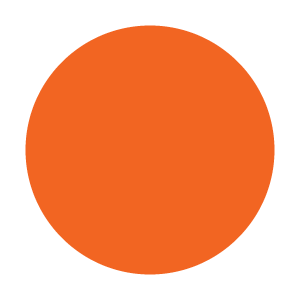

# Summary of Tutorial Content

This tutorial will work through the creation of a simple response time task. The task is to press one key for a blue colored circle and another key for an orange colored circle. Despite this simple task, the tutorial covers many of the key features of jsPsych, including:

* Using a plugin to create a standard trial.
* Combining plugins together to create new kinds of trials.
* Using timeline variables to maximize code reuse.
* Preloading media
* Randomizing presentation order.
* Manipulating, filtering, and aggregating data.
* Using dynamic content to change the experiment parameters based on the subject's responses.

## Part 1: Creating a blank experiment

Start by downloading jsPsych and setting up a folder to contain your experiment files. If you are unsure how to do this, follow steps 1-5 in the [Hello World tutorial](hello-world.md). At the end of step 5 in the Hello World tutorial, you should have an experiment page that looks like this:

```html
<!DOCTYPE html>
<html>
  <head>
    <title>My experiment</title>
    <script src="jspsych-6.3.0/jspsych.js"></script>
    <script src="jspsych-6.3.0/plugins/jspsych-html-keyboard-response.js"></script>
    <link href="jspsych-6.3.0/css/jspsych.css" rel="stylesheet" type="text/css">
  </head>
  <body></body>
</html>
```

This will be our starting point for building the rest of the experiment.

## Part 2: Display welcome message

All jsPsych experiments are defined by a timeline. The timeline is an array that contains the set of trials we want to run in the experiment. We can start by defining the timeline array.

```javascript
var timeline = [];
```

Let's greet the subject with a simple welcome message using the [jspsych-html-keyboard-response](/plugins/jspsych-html-keyboard-response.md) plugin.

First, we create a trial that uses the `jspsych-html-keyboard-response` plugin and contains a simple string to show the subject.

```javascript
var welcome = {
  type: "html-keyboard-response",
  stimulus: "Welcome to the experiment. Press any key to begin."
};
```

Next, we push the welcome trial to the timeline, which adds it to the end of the array.

```javascript
timeline.push(welcome);
```

Finally, we tell jsPsych to run the experiment by calling the [jsPsych.init() function](../core_library/jspsych-core.md#jspsychinit) and passing in the array that defines the experiment timeline.

```javascript
jsPsych.init({
  timeline: timeline
});
```
After each step in the tutorial you can view the complete code up to that point by clicking on the expandable box below.

??? example "The complete code so far"
    ``` html
    <!DOCTYPE html>
    <html>
      <head>
        <title>My experiment</title>
        <script src="jspsych-6.3.0/jspsych.js"></script>
        <script src="jspsych-6.3.0/plugins/jspsych-html-keyboard-response.js"></script>
        <link href="jspsych-6.3.0/css/jspsych.css" rel="stylesheet" type="text/css">
      </head>
      <body></body>
      <script>

        /* create timeline */
        var timeline = [];

        /* define welcome message trial */
        var welcome = {
          type: "html-keyboard-response",
          stimulus: "Welcome to the experiment. Press any key to begin."
        };
        timeline.push(welcome);

        /* start the experiment */
        jsPsych.init({
          timeline: timeline
        });
      </script>
    </html>
    ```

## Part 3: Show instructions

We can use the same basic structure from part 2 to create a new trial that shows instructions to the subject. The only difference in this trial is that we will use HTML formatting to control how the instructions display and we will add a two second gap after the trial using the `post_trial_gap` parameter.

The trial definition looks like this:

```javascript
var instructions = {
  type: "html-keyboard-response",
  stimulus: `
    <p>In this experiment, a circle will appear in the center 
    of the screen.</p><p>If the circle is <strong>blue</strong>, 
    press the letter F on the keyboard as fast as you can.</p>
    <p>If the circle is <strong>orange</strong>, press the letter J 
    as fast as you can.</p>
    <div style='width: 700px;'>
    <div style='float: left;'></img>
    <p class='small'><strong>Press the F key</strong></p></div>
    <div class='float: right;'></img>
    <p class='small'><strong>Press the J key</strong></p></div>
    </div>
    <p>Press any key to begin.</p>
  `,
  post_trial_gap: 2000
};
```

!!! tip
    In JavaScript there are three different ways to define a `string`. You can use single quotes `'`, double quotes `"`, or backticks `` ` ``. Using backticks has two advantages over the other approaches, especially when you are creating long strings with HTML. You can extend the `string` across multiple lines and you can use [template strings](https://developer.mozilla.org/en-US/docs/Web/JavaScript/Reference/Template_literals) to easily incorporate variables.

Notice that the HTML includes `` tags to display the images that the subject will be responding to. You'll need to download these image files. Right-click on each image below and select *Save image as...*. Put the images in a folder called `img` in the experiment folder you created in part 1.




Don't forget to add the trial to the timeline:

```javascript
timeline.push(instructions);
```

??? example "The complete code so far"
    ```html
    <!DOCTYPE html>
    <html>
      <head>
        <title>My experiment</title>
        <script src="jspsych-6.3.0/jspsych.js"></script>
        <script src="jspsych-6.3.0/plugins/jspsych-html-keyboard-response.js"></script>
        <link href="jspsych-6.3.0/css/jspsych.css" rel="stylesheet" type="text/css">
      </head>
      <body></body>
      <script>

        /* create timeline */
        var timeline = [];

        /* define welcome message trial */
        var welcome = {
          type: "html-keyboard-response",
          stimulus: "Welcome to the experiment. Press any key to begin."
        };
        timeline.push(welcome);

        /* define instructions trial */
        var instructions = {
          type: "html-keyboard-response",
          stimulus: `
            <p>In this experiment, a circle will appear in the center 
            of the screen.</p><p>If the circle is <strong>blue</strong>, 
            press the letter F on the keyboard as fast as you can.</p>
            <p>If the circle is <strong>orange</strong>, press the letter J 
            as fast as you can.</p>
            <div style='width: 700px;'>
            <div style='float: left;'></img>
            <p class='small'><strong>Press the F key</strong></p></div>
            <div class='float: right;'></img>
            <p class='small'><strong>Press the J key</strong></p></div>
            </div>
            <p>Press any key to begin.</p>
          `,
          post_trial_gap: 2000
        };
        timeline.push(instructions);

        /* start the experiment */
        jsPsych.init({
          timeline: timeline
        });
      </script>
    </html>
    ```

## Part 4: Displaying stimuli and getting responses

Creating trials to show the stimuli is conceptually the same as creating a trial to show instructions, except that now we are displaying an image instead of text or html. This means we need to use a different plugin: jspsych-image-keyboard-response. We need to start by loading this plugin by adding a `<script>` tag to the document.

```html hl_lines="5"
<head>
  <title>My experiment</title>
  <script src="jspsych-6.3.0/jspsych.js"></script>
  <script src="jspsych-6.3.0/plugins/jspsych-html-keyboard-response.js"></script>
  <script src="jspsych-6.3.0/plugins/jspsych-image-keyboard-response.js"></script>
  <link href="jspsych-6.3.0/css/jspsych.css" rel="stylesheet" type="text/css">
</head>
```

For now, we will just show each image once. The path to the image file should be set as the `stimulus` parameter. We will also set the option for which keys the subject is allowed to use to respond (`choices`) so that only the 'f' and 'j' keys are valid responses.

```javascript
var blue_trial = {
  type: 'image-keyboard-response',
  stimulus: 'img/blue.png',
  choices: ['f', 'j']
};

var orange_trial = {
  type: 'image-keyboard-response',
  stimulus: 'img/orange.png',
  choices: ['f', 'j']
}
```

As usual, we need to add the trials to the timeline.

```javascript
timeline.push(blue_trial, orange_trial);
```

??? example "The complete code so far"

    ```html
    <!DOCTYPE html>
    <html>
      <head>
        <title>My experiment</title>
        <script src="jspsych-6.3.0/jspsych.js"></script>
        <script src="jspsych-6.3.0/plugins/jspsych-html-keyboard-response.js"></script>
        <script src="jspsych-6.3.0/plugins/jspsych-image-keyboard-response.js"></script>
        <link href="jspsych-6.3.0/css/jspsych.css" rel="stylesheet" type="text/css">
      </head>
      <body></body>
      <script>

        /* create timeline */
        var timeline = [];

        /* define welcome message trial */
        var welcome = {
          type: "html-keyboard-response",
          stimulus: "Welcome to the experiment. Press any key to begin."
        };
        timeline.push(welcome);

        /* define instructions trial */
        var instructions = {
          type: "html-keyboard-response",
          stimulus: `
            <p>In this experiment, a circle will appear in the center 
            of the screen.</p><p>If the circle is <strong>blue</strong>, 
            press the letter F on the keyboard as fast as you can.</p>
            <p>If the circle is <strong>orange</strong>, press the letter J 
            as fast as you can.</p>
            <div style='width: 700px;'>
            <div style='float: left;'></img>
            <p class='small'><strong>Press the F key</strong></p></div>
            <div class='float: right;'></img>
            <p class='small'><strong>Press the J key</strong></p></div>
            </div>
            <p>Press any key to begin.</p>
          `,
          post_trial_gap: 2000
        };
        timeline.push(instructions);

        /* test trials */
        var blue_trial = {
          type: 'image-keyboard-response',
          stimulus: 'img/blue.png',
          choices: ['f', 'j']
        };

        var orange_trial = {
          type: 'image-keyboard-response',
          stimulus: 'img/orange.png',
          choices: ['f', 'j']
        }

        timeline.push(blue_trial, orange_trial);

        /* start the experiment */
        jsPsych.init({
          timeline: timeline
        });
      </script>
      </html>
    ```

## Part 5: Preloading media

Whenever we use media elements (images, audio, or video) in an experiment it is a good idea to preload them prior to needing them for a trial. By preloading media we ask the participant's browser to download the media ahead of needing it, so that when we do need to display or play it there is no lag from needing to download it. 

We are going to use the [jspsych-preload plugin](/plugins/jspsych-preload.md) to preload the two images. The [media preloading section](/overview/media-preloading.md) goes into a lot of detail about various options for preloading and different ways that you can use this plugin. Here we are simply going to give the plugin a list of the files that we want to be preloaded.

First we need to add the preload plugin to our `<head>` section.

```html hl_lines="6"
<head>
  <title>My experiment</title>
  <script src="jspsych-6.3.0/jspsych.js"></script>
  <script src="jspsych-6.3.0/plugins/jspsych-html-keyboard-response.js"></script>
  <script src="jspsych-6.3.0/plugins/jspsych-image-keyboard-response.js"></script>
  <script src="jspsych-6.3.0/plugins/jspsych-preload.js"></script>
  <link href="jspsych-6.3.0/css/jspsych.css" rel="stylesheet" type="text/css">
</head>
```


We'll put this trial at the very start of the experiment, so add this code before the `welcome` trial.

```js
var preload = {
  type: 'preload',
  images: ['img/blue.png', 'img/orange.png']
}
```

As always, add the trial to the timeline.

```js
timeline.push(preload);
```

??? example "The complete code so far"

    ```html
    <!DOCTYPE html>
    <html>
      <head>
        <title>My experiment</title>
        <script src="jspsych-6.3.0/jspsych.js"></script>
        <script src="jspsych-6.3.0/plugins/jspsych-html-keyboard-response.js"></script>
        <script src="jspsych-6.3.0/plugins/jspsych-image-keyboard-response.js"></script>
        <script src="jspsych-6.3.0/plugins/jspsych-preload.js"></script>
        <link href="jspsych-6.3.0/css/jspsych.css" rel="stylesheet" type="text/css">
      </head>
      <body></body>
      <script>

        /* create timeline */
        var timeline = [];

        /* preload images */
        var preload = {
          type: 'preload',
          images: ['img/blue.png', 'img/orange.png']
        }
        timeline.push(preload);

        /* define welcome message trial */
        var welcome = {
          type: "html-keyboard-response",
          stimulus: "Welcome to the experiment. Press any key to begin."
        };
        timeline.push(welcome);

        /* define instructions trial */
        var instructions = {
          type: "html-keyboard-response",
          stimulus: `
            <p>In this experiment, a circle will appear in the center 
            of the screen.</p><p>If the circle is <strong>blue</strong>, 
            press the letter F on the keyboard as fast as you can.</p>
            <p>If the circle is <strong>orange</strong>, press the letter J 
            as fast as you can.</p>
            <div style='width: 700px;'>
            <div style='float: left;'></img>
            <p class='small'><strong>Press the F key</strong></p></div>
            <div class='float: right;'></img>
            <p class='small'><strong>Press the J key</strong></p></div>
            </div>
            <p>Press any key to begin.</p>
          `,
          post_trial_gap: 2000
        };
        timeline.push(instructions);

        /* test trials */
        var blue_trial = {
          type: 'image-keyboard-response',
          stimulus: 'img/blue.png',
          choices: ['f', 'j']
        };

        var orange_trial = {
          type: 'image-keyboard-response',
          stimulus: 'img/orange.png',
          choices: ['f', 'j']
        }

        timeline.push(blue_trial, orange_trial);

        /* start the experiment */
        jsPsych.init({
          timeline: timeline
        });
      </script>
      </html>
    ```

## Part 6: Timeline variables

In the full experiment, we will want more than two trials. One way we could do this is to create many more objects that define trials and push them all onto the timeline, but there is a more efficient way: using timeline variables.

The parameters for showing the blue and orange circle are very similar. The only difference is which image is displayed. Timeline variables allow us to define the procedure for showing the stimulus once, and then repeatedly use it with different variables. We'll see how, even in this relatively simple case, this can save us a lot of lines of code.

To start, let's make an array that contains all the different trials we want to run in the test phase. There are only two for the experiment: blue trials and orange trials.

```javascript
var test_stimuli = [
  { stimulus: "img/blue.png"},
  { stimulus: "img/orange.png"}
];
```

Instead of just showing the blue and orange circles, let's also set up the experiment to show a fixation cross (+) in between trials. We can define a trial to show the fixation cross for a fixed amount of time by using the `trial_duration` parameter of the html-keyboard-response plugin and setting the `choices` parameter to the special value `jsPsych.NO_KEYS`, which means that no responses will be accepted as a valid response and the trial will last however long the `trial_duration` parameter specifies.

```javascript
var fixation = {
  type: 'html-keyboard-response',
  stimulus: '<div style="font-size:60px;">+</div>',
  choices: jsPsych.NO_KEYS,
  trial_duration: 1000,
}
```

To show the circles, we'll set up another trial with the html-keyboard-response plugin, but we'll use the function `jsPsych.timelineVariable()` to indicate that we want jsPsych to substitute the value of the parameter in from the timeline variables.

```javascript
var test = {
  type: "image-keyboard-response",
  stimulus: jsPsych.timelineVariable('stimulus'),
  choices: ['f', 'j']
}
```

To link the variables that we declared in the `test_stimuli` array with the call to `jsPsych.timelineVariable()` we need to create a new timeline and set the `timeline_variables` property:

```javascript
var test_procedure = {
  timeline: [fixation, test],
  timeline_variables: test_stimuli
}
```

We have to add the `test_procedure` to the main `timeline` array, but the `fixation` and `test` trial do not need to be added to `timeline` because they already exist on the `test_procedure` timeline.

```javascript
timeline.push(test_procedure);
```

What happens when the experiment reaches the test procedure? jsPsych will run the `test_procedure` timeline one time for each entry in the `test_stimuli` array (two times total, in this case). The first time through, jsPsych will substitute the timeline variables from the first array entry (blue image), and the second time through the second array entry will be used (orange image). Notice that the fixation trial occurs before both the orange and the blue circles, because the entire timeline of the `test_procedure` is repeated for each entry in the `timeline_variables` array.

??? example "The complete code so far"

    ```html
    <!DOCTYPE html>
    <html>
      <head>
        <title>My experiment</title>
        <script src="jspsych-6.3.0/jspsych.js"></script>
        <script src="jspsych-6.3.0/plugins/jspsych-html-keyboard-response.js"></script>
        <script src="jspsych-6.3.0/plugins/jspsych-image-keyboard-response.js"></script>
        <script src="jspsych-6.3.0/plugins/jspsych-preload.js"></script>
        <link href="jspsych-6.3.0/css/jspsych.css" rel="stylesheet" type="text/css">
      </head>
      <body></body>
      <script>

        /* create timeline */
        var timeline = [];

        /* preload images */
        var preload = {
          type: 'preload',
          images: ['img/blue.png', 'img/orange.png']
        }
        timeline.push(preload);

        /* define welcome message trial */
        var welcome = {
          type: "html-keyboard-response",
          stimulus: "Welcome to the experiment. Press any key to begin."
        };
        timeline.push(welcome);

        /* define instructions trial */
        var instructions = {
          type: "html-keyboard-response",
          stimulus: `
            <p>In this experiment, a circle will appear in the center 
            of the screen.</p><p>If the circle is <strong>blue</strong>, 
            press the letter F on the keyboard as fast as you can.</p>
            <p>If the circle is <strong>orange</strong>, press the letter J 
            as fast as you can.</p>
            <div style='width: 700px;'>
            <div style='float: left;'></img>
            <p class='small'><strong>Press the F key</strong></p></div>
            <div class='float: right;'></img>
            <p class='small'><strong>Press the J key</strong></p></div>
            </div>
            <p>Press any key to begin.</p>
          `,
          post_trial_gap: 2000
        };
        timeline.push(instructions);

        /* test trials */
        var test_stimuli = [
          { stimulus: "img/blue.png"},
          { stimulus: "img/orange.png"}
        ];

        var fixation = {
          type: 'html-keyboard-response',
          stimulus: '<div style="font-size:60px;">+</div>',
          choices: jsPsych.NO_KEYS,
          trial_duration: 1000,
        }

        var test = {
          type: "image-keyboard-response",
          stimulus: jsPsych.timelineVariable('stimulus'),
          choices: ['f', 'j']
        }

        var test_procedure = {
          timeline: [fixation, test],
          timeline_variables: test_stimuli
        }

        timeline.push(test_procedure);

        /* start the experiment */
        jsPsych.init({
          timeline: timeline
        });
      </script>
      </html>
    ```


## Part 7: Parameters for timelines with timeline variables

Right now our experiment is a measly two trials long. Even worse is that the order of the stimuli is the same every time! When we use timeline variables, we get access to some methods to randomize the order and repeat the trials. To randomize the order, simply set `randomize_order: true` on the object with the `timeline_variables`:

```javascript
var test_procedure = {
  timeline: [fixation, test],
  timeline_variables: test_stimuli,
  randomize_order: true
}
```

We can also easily make the test phase longer by setting the `repetitions` parameter. This parameter controls how many times the experiment will loop through all of the entries in the timeline_variables array. For example, if we set `repetitions: 5`, then the experiment will loop through the two entries in the timeline_variables 5 times, for a total of 10 test trials.

```javascript
var test_procedure = {
  timeline: [fixation, test],
  timeline_variables: test_stimuli,
  randomize_order: true,
  repetitions: 5
}
```
??? example "The complete code so far"

    ```html
    <!DOCTYPE html>
    <html>
      <head>
        <title>My experiment</title>
        <script src="jspsych-6.3.0/jspsych.js"></script>
        <script src="jspsych-6.3.0/plugins/jspsych-html-keyboard-response.js"></script>
        <script src="jspsych-6.3.0/plugins/jspsych-image-keyboard-response.js"></script>
        <script src="jspsych-6.3.0/plugins/jspsych-preload.js"></script>
        <link href="jspsych-6.3.0/css/jspsych.css" rel="stylesheet" type="text/css">
      </head>
      <body></body>
      <script>

        /* create timeline */
        var timeline = [];

        /* preload images */
        var preload = {
          type: 'preload',
          images: ['img/blue.png', 'img/orange.png']
        }
        timeline.push(preload);

        /* define welcome message trial */
        var welcome = {
          type: "html-keyboard-response",
          stimulus: "Welcome to the experiment. Press any key to begin."
        };
        timeline.push(welcome);

        /* define instructions trial */
        var instructions = {
          type: "html-keyboard-response",
          stimulus: `
            <p>In this experiment, a circle will appear in the center 
            of the screen.</p><p>If the circle is <strong>blue</strong>, 
            press the letter F on the keyboard as fast as you can.</p>
            <p>If the circle is <strong>orange</strong>, press the letter J 
            as fast as you can.</p>
            <div style='width: 700px;'>
            <div style='float: left;'></img>
            <p class='small'><strong>Press the F key</strong></p></div>
            <div class='float: right;'></img>
            <p class='small'><strong>Press the J key</strong></p></div>
            </div>
            <p>Press any key to begin.</p>
          `,
          post_trial_gap: 2000
        };
        timeline.push(instructions);

        /* test trials */
        var test_stimuli = [
          { stimulus: "img/blue.png"},
          { stimulus: "img/orange.png"}
        ];

        var fixation = {
          type: 'html-keyboard-response',
          stimulus: '<div style="font-size:60px;">+</div>',
          choices: jsPsych.NO_KEYS,
          trial_duration: 1000,
        }

        var test = {
          type: "image-keyboard-response",
          stimulus: jsPsych.timelineVariable('stimulus'),
          choices: ['f', 'j']
        }

        var test_procedure = {
          timeline: [fixation, test],
          timeline_variables: test_stimuli,
          randomize_order: true,
          repetitions: 5
        }

        timeline.push(test_procedure);

        /* start the experiment */
        jsPsych.init({
          timeline: timeline
        });
      </script>
      </html>
    ```

## Part 8: Using functions to generate parameters

One aspect of the experiment that could be improved is the duration of the fixation cross. As the experiment stands right now, the timing of the circles appearing is very predictable. We can change that by using a different value for the `trial_duration` parameter in the `fixation` trial for each trial. But how can we do that and keep the simple code structure we have now where we only have to define the fixation trial once? One option would be to add another timeline variable, like `"fixation_duration"` and use that to control the timing. But another option is to specify the `trial_duration` parameter as a function. If a parameter is a function, jsPsych will execute the function every time the trial runs. That means that if the function returns different results probabilistically, we can get a different parameter value every time the trial runs.

To do that here, we'll use one of the built-in randomization methods in [jsPsych's randomization module](/core_library/jspsych-randomization.md). `jsPsych.randomization.sampleWithoutReplacement()` takes an array of items to sample from and generates a new array of length *N* by sampling without replacement.

```javascript
var fixation = {
  type: 'html-keyboard-response',
  stimulus: '<div style="font-size:60px;">+</div>',
  choices: jsPsych.NO_KEYS,
  trial_duration: function(){
    return jsPsych.randomization.sampleWithoutReplacement([250, 500, 750, 1000, 1250, 1500, 1750, 2000], 1)[0];
  }
}
```

In the code above, we replaced the `trial_duration: 1000` parameter in `fixation` with a function. Inside the function, we take a sample from the array `[250, 500, 750, 1000, 1250, 1500, 1750, 2000]` of size 1 (second parameter to `jsPsych.randomization.sampleWithoutReplacement`). The return value from calling `jsPsych.randomization.sampleWithoutReplacement` is an array of length 1, so we add the `[0]` selection at the end to get the value out of the array.

??? example "The complete code so far"

    ```html
    <!DOCTYPE html>
    <html>
      <head>
        <title>My experiment</title>
        <script src="jspsych-6.3.0/jspsych.js"></script>
        <script src="jspsych-6.3.0/plugins/jspsych-html-keyboard-response.js"></script>
        <script src="jspsych-6.3.0/plugins/jspsych-image-keyboard-response.js"></script>
        <script src="jspsych-6.3.0/plugins/jspsych-preload.js"></script>
        <link href="jspsych-6.3.0/css/jspsych.css" rel="stylesheet" type="text/css">
      </head>
      <body></body>
      <script>

        /* create timeline */
        var timeline = [];

        /* preload images */
        var preload = {
          type: 'preload',
          images: ['img/blue.png', 'img/orange.png']
        }
        timeline.push(preload);

        /* define welcome message trial */
        var welcome = {
          type: "html-keyboard-response",
          stimulus: "Welcome to the experiment. Press any key to begin."
        };
        timeline.push(welcome);

        /* define instructions trial */
        var instructions = {
          type: "html-keyboard-response",
          stimulus: `
            <p>In this experiment, a circle will appear in the center 
            of the screen.</p><p>If the circle is <strong>blue</strong>, 
            press the letter F on the keyboard as fast as you can.</p>
            <p>If the circle is <strong>orange</strong>, press the letter J 
            as fast as you can.</p>
            <div style='width: 700px;'>
            <div style='float: left;'></img>
            <p class='small'><strong>Press the F key</strong></p></div>
            <div class='float: right;'></img>
            <p class='small'><strong>Press the J key</strong></p></div>
            </div>
            <p>Press any key to begin.</p>
          `,
          post_trial_gap: 2000
        };
        timeline.push(instructions);

        /* test trials */
        var test_stimuli = [
          { stimulus: "img/blue.png"},
          { stimulus: "img/orange.png"}
        ];

        var fixation = {
          type: 'html-keyboard-response',
          stimulus: '<div style="font-size:60px;">+</div>',
          choices: jsPsych.NO_KEYS,
          trial_duration: function(){
            return jsPsych.randomization.sampleWithoutReplacement([250, 500, 750, 1000, 1250, 1500, 1750, 2000], 1)[0];
          }
        }

        var test = {
          type: "image-keyboard-response",
          stimulus: jsPsych.timelineVariable('stimulus'),
          choices: ['f', 'j']
        }

        var test_procedure = {
          timeline: [fixation, test],
          timeline_variables: test_stimuli,
          randomize_order: true,
          repetitions: 5
        }

        timeline.push(test_procedure);

        /* start the experiment */
        jsPsych.init({
          timeline: timeline
        });
      </script>
      </html>
    ```

## Part 10: Displaying the data

We have created a complete, if simple, experiment at this point, so let's take a look at the data being generated. jsPsych has a built-in [function called `jsPsych.data.displayData()`](/core_library/jspsych-data.md#jspsychdatadisplaydata) that is useful for debugging your experiment. It will remove all of the information on the screen and replace it with the raw data collected so far. This isn't terribly useful when you are actually running an experiment, but it's nice for checking the data during development.

We need the `displayData` function to execute when the experiment ends. One way to do this is to use the [`on_finish` callback function](/overview/callbacks.md#on_finish-experiment). This function will automatically execute once all the trials in the experiment are finished. We can specify a function to call in the `init` method.

```javascript
jsPsych.init({
  timeline: timeline,
  on_finish: function() {
    jsPsych.data.displayData();
  }
});
```

??? example "The complete code so far"

    ```html
    <!DOCTYPE html>
    <html>
      <head>
        <title>My experiment</title>
        <script src="jspsych-6.3.0/jspsych.js"></script>
        <script src="jspsych-6.3.0/plugins/jspsych-html-keyboard-response.js"></script>
        <script src="jspsych-6.3.0/plugins/jspsych-image-keyboard-response.js"></script>
        <script src="jspsych-6.3.0/plugins/jspsych-preload.js"></script>
        <link href="jspsych-6.3.0/css/jspsych.css" rel="stylesheet" type="text/css">
      </head>
      <body></body>
      <script>

        /* create timeline */
        var timeline = [];

        /* preload images */
        var preload = {
          type: 'preload',
          images: ['img/blue.png', 'img/orange.png']
        }
        timeline.push(preload);

        /* define welcome message trial */
        var welcome = {
          type: "html-keyboard-response",
          stimulus: "Welcome to the experiment. Press any key to begin."
        };
        timeline.push(welcome);

        /* define instructions trial */
        var instructions = {
          type: "html-keyboard-response",
          stimulus: `
            <p>In this experiment, a circle will appear in the center 
            of the screen.</p><p>If the circle is <strong>blue</strong>, 
            press the letter F on the keyboard as fast as you can.</p>
            <p>If the circle is <strong>orange</strong>, press the letter J 
            as fast as you can.</p>
            <div style='width: 700px;'>
            <div style='float: left;'></img>
            <p class='small'><strong>Press the F key</strong></p></div>
            <div class='float: right;'></img>
            <p class='small'><strong>Press the J key</strong></p></div>
            </div>
            <p>Press any key to begin.</p>
          `,
          post_trial_gap: 2000
        };
        timeline.push(instructions);

        /* test trials */
        var test_stimuli = [
          { stimulus: "img/blue.png"},
          { stimulus: "img/orange.png"}
        ];

        var fixation = {
          type: 'html-keyboard-response',
          stimulus: '<div style="font-size:60px;">+</div>',
          choices: jsPsych.NO_KEYS,
          trial_duration: function(){
            return jsPsych.randomization.sampleWithoutReplacement([250, 500, 750, 1000, 1250, 1500, 1750, 2000], 1)[0];
          }
        }

        var test = {
          type: "image-keyboard-response",
          stimulus: jsPsych.timelineVariable('stimulus'),
          choices: ['f', 'j']
        }

        var test_procedure = {
          timeline: [fixation, test],
          timeline_variables: test_stimuli,
          randomize_order: true,
          repetitions: 5
        }

        timeline.push(test_procedure);

        /* start the experiment */
        jsPsych.init({
          timeline: timeline,
          on_finish: function() {
            jsPsych.data.displayData();
          }
        });
      </script>
      </html>
    ```

## Part 11: Tagging trials with additional data

All trials in jsPsych can be tagged with additional arbitrary data. This data will get stored alongside the data that the plugin normally generates, which allows experimenters to record properties of a trial along with the data from the trial.

When might you use this feature? In this experiment, it would be nice to tag each trial with a circle as a `response` trial, so that the resulting data can be easily filtered to look at only the critical trials. We can do that like this.

```javascript
var test = {
  type: "image-keyboard-response",
  stimulus: jsPsych.timelineVariable('stimulus'),
  choices: ['f', 'j'],
  data: {
    task: 'response'
  }
}
```

We also could tag the test trials with a property that indicates what the correct response should be (F for the blue circles, J for the orange). In our current code, we are using the timeline variables feature of jsPsych to choose which circle gets presented on a trial. Since we want to tag the trials differently based on which circle is presented, we need to add the tagging data to the `test_stimuli` array, and then use the `jsPsych.timelineVariable()` function to get the value and assign it to a property in the `data` of the trial.

We start by modifying `test_stimuli`:

```javascript
var test_stimuli = [
  { stimulus: "img/blue.png",  correct_response: 'f'},
  { stimulus: "img/orange.png",  correct_response: 'j'}
];
```

Now we can use `timelineVariable()` in the `data` parameter of the `test` trial.

```javascript
var test = {
  type: "image-keyboard-response",
  stimulus: jsPsych.timelineVariable('stimulus'),
  choices: ['f', 'j'],
  data: {
    task: 'response',
    correct_response: jsPsych.timelineVariable('correct_response')
  }
}
```

Another kind of tagging that would be useful is to mark each fixation trial as such, to make removing the data from fixation trials easier. 

```js
var fixation = {
  type: 'html-keyboard-response',
  stimulus: '<div style="font-size:60px;">+</div>',
  choices: jsPsych.NO_KEYS,
  trial_duration: function(){
    return jsPsych.randomization.sampleWithoutReplacement([250, 500, 750, 1000, 1250, 1500, 1750, 2000], 1)[0];
  },
  data: {
    task: 'fixation'
  }
}
```

??? example "The complete code so far"

    ```html
    <!DOCTYPE html>
    <html>
      <head>
        <title>My experiment</title>
        <script src="jspsych-6.3.0/jspsych.js"></script>
        <script src="jspsych-6.3.0/plugins/jspsych-html-keyboard-response.js"></script>
        <script src="jspsych-6.3.0/plugins/jspsych-image-keyboard-response.js"></script>
        <script src="jspsych-6.3.0/plugins/jspsych-preload.js"></script>
        <link href="jspsych-6.3.0/css/jspsych.css" rel="stylesheet" type="text/css">
      </head>
      <body></body>
      <script>

        /* create timeline */
        var timeline = [];

        /* preload images */
        var preload = {
          type: 'preload',
          images: ['img/blue.png', 'img/orange.png']
        }
        timeline.push(preload);

        /* define welcome message trial */
        var welcome = {
          type: "html-keyboard-response",
          stimulus: "Welcome to the experiment. Press any key to begin."
        };
        timeline.push(welcome);

        /* define instructions trial */
        var instructions = {
          type: "html-keyboard-response",
          stimulus: `
            <p>In this experiment, a circle will appear in the center 
            of the screen.</p><p>If the circle is <strong>blue</strong>, 
            press the letter F on the keyboard as fast as you can.</p>
            <p>If the circle is <strong>orange</strong>, press the letter J 
            as fast as you can.</p>
            <div style='width: 700px;'>
            <div style='float: left;'></img>
            <p class='small'><strong>Press the F key</strong></p></div>
            <div class='float: right;'></img>
            <p class='small'><strong>Press the J key</strong></p></div>
            </div>
            <p>Press any key to begin.</p>
          `,
          post_trial_gap: 2000
        };
        timeline.push(instructions);

        /* test trials */
        var test_stimuli = [
          { stimulus: "img/blue.png",  correct_response: 'f'},
          { stimulus: "img/orange.png",  correct_response: 'j'}
        ];

        var fixation = {
          type: 'html-keyboard-response',
          stimulus: '<div style="font-size:60px;">+</div>',
          choices: jsPsych.NO_KEYS,
          trial_duration: function(){
            return jsPsych.randomization.sampleWithoutReplacement([250, 500, 750, 1000, 1250, 1500, 1750, 2000], 1)[0];
          },
          data: {
            task: 'fixation'
          }
        }

        var test = {
          type: "image-keyboard-response",
          stimulus: jsPsych.timelineVariable('stimulus'),
          choices: ['f', 'j'],
          data: {
            task: 'response',
            correct_response: jsPsych.timelineVariable('correct_response')
          }
        }

        var test_procedure = {
          timeline: [fixation, test],
          timeline_variables: test_stimuli,
          randomize_order: true,
          repetitions: 5
        }

        timeline.push(test_procedure);

        /* start the experiment */
        jsPsych.init({
          timeline: timeline,
          on_finish: function() {
            jsPsych.data.displayData();
          }
        });
      </script>
      </html>
    ```

## Part 12: Manipulating data during the experiment

Now that the data from the test trials has a tag that describes the correct response, it would be easy to analyze the data after the fact and calculate whether the participant responded correctly.

But, we can also do this in jsPsych as the experiment runs to save time later and enable a limited set of data analysis directly in the experiment code.

To do this, we'll use the `on_finish` event of the test trial. We can assign a function to `on_finish`, and that function will receive an object containing the data generated by the trial. This object can be manipulated inside the function, and any changes made to the object will be stored in jsPsych's internal representation of the data.

For this example, we'll calculate whether the subject responded correctly, and add a new `correct` property to the data object.

```javascript
var test = {
  type: "image-keyboard-response",
  stimulus: jsPsych.timelineVariable('stimulus'),
  choices: ['f', 'j'],
  data: {
    task: 'response',
    correct_response: jsPsych.timelineVariable('correct_response')
  },
  on_finish: function(data){
    data.correct = jsPsych.pluginAPI.compareKeys(data.response, data.correct_response);
  }
}
```

The `data.response` value is a string representation of the key the subject pressed. We can compare this with the `data.correct_response` value, and assign this computed value to a new property `data.correct`.

??? example "The complete code so far"

    ```html
    <!DOCTYPE html>
    <html>
      <head>
        <title>My experiment</title>
        <script src="jspsych-6.3.0/jspsych.js"></script>
        <script src="jspsych-6.3.0/plugins/jspsych-html-keyboard-response.js"></script>
        <script src="jspsych-6.3.0/plugins/jspsych-image-keyboard-response.js"></script>
        <script src="jspsych-6.3.0/plugins/jspsych-preload.js"></script>
        <link href="jspsych-6.3.0/css/jspsych.css" rel="stylesheet" type="text/css">
      </head>
      <body></body>
      <script>

        /* create timeline */
        var timeline = [];

        /* preload images */
        var preload = {
          type: 'preload',
          images: ['img/blue.png', 'img/orange.png']
        }
        timeline.push(preload);

        /* define welcome message trial */
        var welcome = {
          type: "html-keyboard-response",
          stimulus: "Welcome to the experiment. Press any key to begin."
        };
        timeline.push(welcome);

        /* define instructions trial */
        var instructions = {
          type: "html-keyboard-response",
          stimulus: `
            <p>In this experiment, a circle will appear in the center 
            of the screen.</p><p>If the circle is <strong>blue</strong>, 
            press the letter F on the keyboard as fast as you can.</p>
            <p>If the circle is <strong>orange</strong>, press the letter J 
            as fast as you can.</p>
            <div style='width: 700px;'>
            <div style='float: left;'></img>
            <p class='small'><strong>Press the F key</strong></p></div>
            <div class='float: right;'></img>
            <p class='small'><strong>Press the J key</strong></p></div>
            </div>
            <p>Press any key to begin.</p>
          `,
          post_trial_gap: 2000
        };
        timeline.push(instructions);

        /* test trials */
        var test_stimuli = [
          { stimulus: "img/blue.png",  correct_response: 'f'},
          { stimulus: "img/orange.png",  correct_response: 'j'}
        ];

        var fixation = {
          type: 'html-keyboard-response',
          stimulus: '<div style="font-size:60px;">+</div>',
          choices: jsPsych.NO_KEYS,
          trial_duration: function(){
            return jsPsych.randomization.sampleWithoutReplacement([250, 500, 750, 1000, 1250, 1500, 1750, 2000], 1)[0];
          },
          data: {
            task: 'fixation'
          }
        }

        var test = {
          type: "image-keyboard-response",
          stimulus: jsPsych.timelineVariable('stimulus'),
          choices: ['f', 'j'],
          data: {
            task: 'response',
            correct_response: jsPsych.timelineVariable('correct_response')
          },
          on_finish: function(data){
            data.correct = jsPsych.pluginAPI.compareKeys(data.response, data.correct_response);
          }
        }

        var test_procedure = {
          timeline: [fixation, test],
          timeline_variables: test_stimuli,
          randomize_order: true,
          repetitions: 5
        }

        timeline.push(test_procedure);

        /* start the experiment */
        jsPsych.init({
          timeline: timeline,
          on_finish: function() {
            jsPsych.data.displayData();
          }
        });
      </script>
      </html>
    ```


## Part 13: Data aggregation

jsPsych provides a limited set of analysis functions to allow you to calculate things like mean response times for a selected set of trials. In this part, we'll use these functions to add a final trial to the experiment that tells the subject their accuracy and their mean response time for correct responses.

We'll use the `html-keyboard-response` plugin. Because the text that we want to display changes based on the subject's performance in the experiment, we need to use a function for the `stimulus` parameter and return the desired text.

Here's what the code looks like, and a description follows below.

```js
var debrief_block = {
  type: "html-keyboard-response",
  stimulus: function() {

    var trials = jsPsych.data.get().filter({task: 'response'});
    var correct_trials = trials.filter({correct: true});
    var accuracy = Math.round(correct_trials.count() / trials.count() * 100);
    var rt = Math.round(correct_trials.select('rt').mean());

    return `<p>You responded correctly on ${accuracy}% of the trials.</p>
      <p>Your average response time was ${rt}ms.</p>
      <p>Press any key to complete the experiment. Thank you!</p>`;

  }
};

timeline.push(debrief_block);
```

To create the variable `trials`, we use `jsPsych.data.get()` which returns a jsPsych data collection containing all of the data from the experiment. We can then use `.filter` to select only the trials where `task` is `'response'` (a benefit of tagging the trials in part 11). `trials` contains all of the data from the trials where a circle was shown.

To get only the correct trials, we can use `.filter()` again to select only the trials from the `trials` data collection where the property `correct` is `true`.

To calculate accuracy, we can use the `.count()` method to determine how many trials were correct and how many trials there were total. We also use `Math.round()` to avoid extra digits after the decimal.

Finally, to calculate the mean response time on correct trials, we use the `.select` method on the `correct_trials` data collection to select only the `'rt'` property of those trials. We can then use the `.mean()` method to find the mean of all the RT values.

## The final code

This code is available in the `/examples` folder in the jsPsych release download. It is called `demo-simple-rt-task.html`.

```html
<!DOCTYPE html>
<html>
  <head>
    <title>My experiment</title>
    <script src="jspsych-6.3.0/jspsych.js"></script>
    <script src="jspsych-6.3.0/plugins/jspsych-html-keyboard-response.js"></script>
    <script src="jspsych-6.3.0/plugins/jspsych-image-keyboard-response.js"></script>
    <script src="jspsych-6.3.0/plugins/jspsych-preload.js"></script>
    <link href="jspsych-6.3.0/css/jspsych.css" rel="stylesheet" type="text/css">
  </head>
  <body></body>
  <script>

    /* create timeline */
    var timeline = [];

    /* preload images */
    var preload = {
      type: 'preload',
      images: ['img/blue.png', 'img/orange.png']
    }
    timeline.push(preload);

    /* define welcome message trial */
    var welcome = {
      type: "html-keyboard-response",
      stimulus: "Welcome to the experiment. Press any key to begin."
    };
    timeline.push(welcome);

    /* define instructions trial */
    var instructions = {
      type: "html-keyboard-response",
      stimulus: `
        <p>In this experiment, a circle will appear in the center 
        of the screen.</p><p>If the circle is <strong>blue</strong>, 
        press the letter F on the keyboard as fast as you can.</p>
        <p>If the circle is <strong>orange</strong>, press the letter J 
        as fast as you can.</p>
        <div style='width: 700px;'>
        <div style='float: left;'></img>
        <p class='small'><strong>Press the F key</strong></p></div>
        <div class='float: right;'></img>
        <p class='small'><strong>Press the J key</strong></p></div>
        </div>
        <p>Press any key to begin.</p>
      `,
      post_trial_gap: 2000
    };
    timeline.push(instructions);

    /* test trials */
    var test_stimuli = [
      { stimulus: "img/blue.png",  correct_response: 'f'},
      { stimulus: "img/orange.png",  correct_response: 'j'}
    ];

    var fixation = {
      type: 'html-keyboard-response',
      stimulus: '<div style="font-size:60px;">+</div>',
      choices: jsPsych.NO_KEYS,
      trial_duration: function(){
        return jsPsych.randomization.sampleWithoutReplacement([250, 500, 750, 1000, 1250, 1500, 1750, 2000], 1)[0];
      },
      data: {
        task: 'fixation'
      }
    }

    var test = {
      type: "image-keyboard-response",
      stimulus: jsPsych.timelineVariable('stimulus'),
      choices: ['f', 'j'],
      data: {
        task: 'response',
        correct_response: jsPsych.timelineVariable('correct_response')
      },
      on_finish: function(data){
        data.correct = jsPsych.pluginAPI.compareKeys(data.response, data.correct_response);
      }
    }

    var test_procedure = {
      timeline: [fixation, test],
      timeline_variables: test_stimuli,
      repetitions: 5,
      randomize_order: true
    }
    timeline.push(test_procedure);

    /* define debrief */

    var debrief_block = {
      type: "html-keyboard-response",
      stimulus: function() {

        var trials = jsPsych.data.get().filter({task: 'response'});
        var correct_trials = trials.filter({correct: true});
        var accuracy = Math.round(correct_trials.count() / trials.count() * 100);
        var rt = Math.round(correct_trials.select('rt').mean());

        return `<p>You responded correctly on ${accuracy}% of the trials.</p>
          <p>Your average response time was ${rt}ms.</p>
          <p>Press any key to complete the experiment. Thank you!</p>`;

      }
    };
    timeline.push(debrief_block);

    /* start the experiment */
    jsPsych.init({
      timeline: timeline,
      on_finish: function() {
        jsPsych.data.displayData();
      }
    });
  </script>
</html>
```
